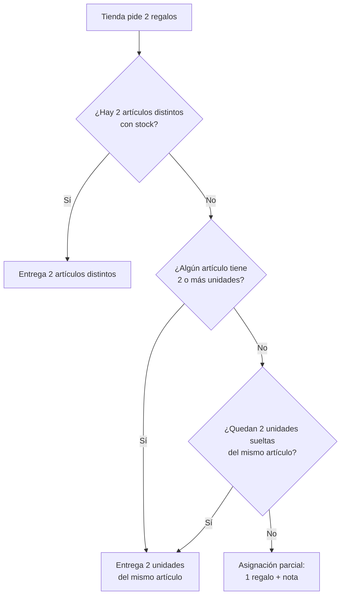

# Asignador de regalos a tiendas

Aplicación en Streamlit que reparte artículos de un inventario entre tiendas,
respetando la zona y el tipo de regalo de cada una, y genera el Excel de
asignación junto con un reporte de excepciones.

---

## Puesta en marcha

```bash
pip install -r requirements.txt
streamlit run app.py
```

La app queda en <http://localhost:8501>.

Para trabajar sobre el código, instala también las herramientas de prueba:

```bash
pip install -r requirements-dev.txt
pytest
```

---

## Archivos de entrada

Se suben dos `.xlsx` desde la interfaz. El orden de las columnas no importa y
las columnas adicionales se conservan sin tocarlas.

Los **nombres** de las columnas se reconocen ignorando mayúsculas, acentos,
espacios y guiones bajos, así que `tamaño`, `TAMAÑO` y `Tamano` valen igual.
Cuando una columna admite varios nombres, se usa el primero que aparezca en la
lista.

Si el libro tiene **varias hojas**, se elige automáticamente la que mejor calza
con las columnas esperadas, no la primera. La plantilla real de tiendas trae una
tabla dinámica en la primera hoja; sin esta selección la carga fallaba con
encabezados sin sentido. La pestaña *Vistas Previas* de la app indica qué hoja
se leyó: **es lo primero que hay que revisar ante cualquier duda de mapeo.**

### `inventario.xlsx`

> ⚠️ El encabezado debe estar en la **fila 3**: la lectura salta las dos
> primeras filas, que en el reporte de origen vienen con títulos.

| Nombre interno        | Columna en el Excel                        | Significado                          |
| --------------------- | ------------------------------------------ | ------------------------------------ |
| `FechaIngreso`        | `FECHACONTABILIZACION` o `FECHAINGRESO`    | Fecha de ingreso del artículo        |
| `ZonaElegible`        | `ZONA` o `ZONAELEGIBLE`                    | Zona en la que el artículo es válido |
| `TipoRegalo`          | `TIPOREGALO`                               | Segmento de tienda que lo recibe     |
| `CodigoArticulo`      | `ID`                                       | Código del artículo                  |
| `DescripcionArticulo` | `OBSERVACION` o `DESCRIPCIONARTICULO`      | Descripción del artículo             |
| `CantidadDisponible`  | `CANTIDAD` o `SALDO`                       | Unidades disponibles                 |

Las filas con cantidad igual o menor a cero se descartan antes de asignar.

### `tiendas.xlsx`

> El encabezado va en la **fila 1**, sin filas previas.

| Nombre interno | Columna en el Excel      | Significado                       |
| -------------- | ------------------------ | --------------------------------- |
| `IDTienda`     | `CODIGO`                 | Identificador de la tienda        |
| `NombreTienda` | `NOMBRE_COLABORADOR`     | Nombre de la tienda               |
| `Zona`         | `TERRITORIO` o `ZONA`    | Zona a la que pertenece           |
| `TipoRegalo`   | `TAMAÑO` o `TIPOREGALO`  | Segmento de la tienda             |

> ⚠️ La plantilla de tiendas llama **`tamaño`** al mismo concepto que el
> inventario llama **`TIPOREGALO`**: es la columna con la que se cruzan los dos
> archivos. Ambos nombres se aceptan.

### Sobre las fechas

El formato esperado es `MM/DD/AAAA HH:MM:SS AM` (por ejemplo,
`01/15/2025 10:30:00 AM`). Si el archivo trae otro formato, se intenta un
parseo flexible y **las fechas que no se logren interpretar se informan en el
reporte**. Esto importa porque las estrategias `Sobrantes` y `Novedades`
ordenan por fecha: si no se interpreta, el orden pierde sentido.

Una celda de fecha **vacía** no cuenta como formato inválido y no genera
advertencia: parte del stock llega sin fecha de contabilización.

---

## Cómo asigna

El cruce entre tienda e inventario se hace por **zona** (`Zona` contra
`ZonaElegible`) y por **segmento** (`TipoRegalo` en ambos lados). La
comparación ignora mayúsculas, espacios sobrantes y **acentos**, de modo que
`"  lima "` y `"LIMA"` son la misma zona, y `Huarochirí` cruza con
`HUAROCHIRI`. Los valores originales se conservan intactos en el archivo de
salida.

> ⚠️ Fuera de eso, el cruce es **exacto**: no hay tabla de sinónimos. Si el
> inventario dice `MEDIANO` y las tiendas dicen `MEDIANA`, no cruzan y esas
> tiendas se reportan sin asignación. Los dos archivos deben usar el mismo
> vocabulario de segmento en el origen. Del mismo modo, el stock de una zona
> que ninguna tienda declara (por ejemplo `LIMA Almacen`) queda sin repartir.
> Revisa siempre el conteo de "Tiendas con asignación" del reporte: si es
> mucho más bajo de lo esperado, casi siempre es un desajuste de vocabulario y
> no un error del programa.

### Estrategias de priorización

Definen qué artículos se consumen primero dentro de cada tipo de regalo.

| Estrategia   | Prioriza                                                        |
| ------------ | --------------------------------------------------------------- |
| `Sobrantes`  | Lo más antiguo y con menos stock: sirve para liquidar remanentes |
| `Novedades`  | Lo más reciente y con más stock                                  |
| `AltoStock`  | Lo que más unidades tiene disponibles                            |
| `Equitativo` | Rota entre artículos para repartir el consumo de forma pareja    |

### Regalos por tienda

Se elige 1 o 2. Con dos regalos, se busca **darle variedad a la tienda**:



Si no alcanza ni para uno, la tienda queda sin asignación y el motivo se
registra en la columna `NOTAS` y en el reporte.

---

## Archivos de salida

### `asignacion_final.xlsx`

Hoja **`Asignacion`** — todas las columnas del archivo de tiendas, más:

| Columna         | Contenido                                       |
| --------------- | ----------------------------------------------- |
| `REGALO_1`      | Código del primer artículo asignado             |
| `DESC_REGALO_1` | Descripción del primer artículo                 |
| `REGALO_2`      | Código del segundo artículo (si aplica)         |
| `DESC_REGALO_2` | Descripción del segundo artículo                |
| `NOTAS`         | Asignación parcial, o el motivo de no recibir nada |

Hoja **`InventarioRestante`** — el stock que quedó sin repartir.

### `reporte.txt`

Resumen de la corrida: estrategia usada, tiendas procesadas, tiendas con
asignación, asignaciones parciales, unidades restantes, advertencias de
fechas y el detalle de cada excepción.

---

## Verificar un despliegue

La app se despliega en Streamlit Community Cloud y se actualiza sola con cada
push a `master`. Bajo el título aparece una franja con la identidad exacta del
código que está corriendo:

```
ASIGNADOR DE REGALOS                        ● OPERATIVO
e900b18  v2.0.0  |  activo desde 07/09/2026 11:20 (America/Lima)
[python 3.12.2] [streamlit 1.49.0] [pandas 2.2.3] [openpyxl 3.1.5]
```

- **La huella** (`e900b18`) es un hash del contenido de los archivos `.py`.
  Cambia sola con cualquier modificación del código, así que no depende de
  recordar subir el número de versión. **Si tras un push sigue siendo la
  misma, el despliegue no tomó el código nuevo** → *Manage app* → `⋮` →
  *Reboot app*.
- **Los chips de librerías** confirman que el entorno se reconstruyó bien.
- **El panel lateral** ejecuta el motor real de asignación y comprueba que las
  correcciones estén activas. Si algo sale en rojo, el despliegue quedó a
  medias y el detalle indica qué falló.
- **El botón "Datos de ejemplo"** corre una asignación completa con datos
  integrados, sin necesidad de subir archivos.

Al hacer cambios de fondo, sube `VERSION` en `info_version.py`. La huella
funciona igual si lo olvidas; el número es solo para lectura humana.

---

## Estructura

| Archivo                | Responsabilidad                                        |
| ---------------------- | ------------------------------------------------------ |
| `app.py`               | Interfaz de Streamlit                                  |
| `carga_datos.py`       | Lectura y validación de los Excel (sin Streamlit)      |
| `asignador_regalos.py` | Motor de asignación y generación del Excel             |
| `info_version.py`      | Huella del código, entorno y autodiagnóstico           |
| `tests/`               | Pruebas con pytest                                     |

`carga_datos.py` se mantiene libre de Streamlit a propósito: devuelve los
mensajes de error en vez de mostrarlos, y por eso puede probarse aislado.

---

## Notas

- Los `.xlsx` están excluidos por `.gitignore`: los datos de tiendas e
  inventario no deben subirse al repositorio.
- Las pruebas construyen sus propios Excel en memoria, replicando la
  estructura real (incluidas las dos filas previas al encabezado del
  inventario). No hace falta ningún archivo para correr `pytest`.
