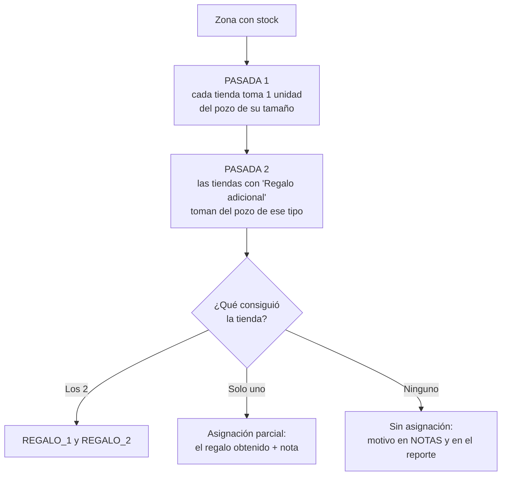

# Regalo adicional por tienda — Plan de implementación

> **For agentic workers:** REQUIRED SUB-SKILL: Use superpowers:subagent-driven-development (recommended) or superpowers:executing-plans to implement this plan task-by-task. Steps use checkbox (`- [ ]`) syntax for tracking.

**Goal:** Que la cantidad de regalos de cada tienda salga de la columna opcional `Regalo adicional` de la plantilla de tiendas —que además indica de qué tipo sale el segundo regalo— en vez de un selector global de 1 ó 2, y que el primer regalo de todas las tiendas tenga prioridad sobre cualquier regalo adicional.

**Architecture:** `carga_datos.py` aprende el concepto de columna opcional: si `Regalo adicional` está la mapea, y si no la crea vacía sin fallar. `asignador_regalos.py` deja de recibir `n_regalos` y pasa a asignar en dos pasadas por zona: primero un regalo del pozo de su `tamaño` para cada tienda, y recién después el adicional del pozo que nombre su celda, con el stock sobrante. La unidad de trabajo del motor pasa a ser `tomar_regalo()`, que entrega una sola unidad.

**Tech Stack:** Python 3.12, pandas, openpyxl, Streamlit, pytest.

**Spec:** `docs/superpowers/specs/2026-09-09-regalo-adicional-design.md`

---

## Estructura de archivos

| Archivo | Responsabilidad | Cambio |
| --- | --- | --- |
| `carga_datos.py` | Lectura y validación de los Excel, sin Streamlit | Columnas opcionales + `TDAS_COLUMNAS_OPCIONALES` |
| `asignador_regalos.py` | Motor de asignación y generación del Excel | `tomar_regalo()`, dos pasadas, se va `n_regalos` |
| `app.py` | Interfaz Streamlit | Se quita el selector; aviso de columna ausente; métrica nueva |
| `info_version.py` | Huella, entorno y autodiagnóstico | Datos de ejemplo y chequeos nuevos; `VERSION` a 3.0.0 |
| `tests/test_carga_datos.py` | Pruebas de carga | Casos de columna opcional |
| `tests/test_asignador.py` | Pruebas del motor | Firma nueva + casos de prioridad y adicional |
| `tests/test_app_smoke.py` | Smoke de la UI | Se ajusta al selector eliminado |
| `tests/test_info_version.py` | Pruebas del autodiagnóstico | Firma nueva |
| `README.md` | Documentación de entrada/salida | Columna nueva y regla de prioridad |

**Orden:** las tareas 1 y 2 son aditivas y dejan la suite verde. La tarea 3 es el cambio incompatible de firma y toca todos los llamadores en un solo commit. Las tareas 4, 5 y 6 son aditivas otra vez.

---

## Task 1: Columna opcional en la carga

**Files:**
- Modify: `carga_datos.py`
- Test: `tests/test_carga_datos.py`

- [ ] **Step 1: Escribir las pruebas que fallan**

Agregar al final de `tests/test_carga_datos.py`:

```python
# ---------------------------------------------------------------------------
# Columnas opcionales
# ---------------------------------------------------------------------------
def test_mapea_la_columna_de_regalo_adicional_cuando_esta_presente():
    df = pd.DataFrame(
        [
            {
                "CODIGO": 1,
                "NOMBRE_COLABORADOR": "Tienda A",
                "TERRITORIO": "LIMA SUR",
                "tamaño": "mediana",
                "Regalo adicional": "pequeña",
            }
        ]
    )

    resultado, errores = preparar_dataframe(
        df, TDAS_COLUMNAS, "Tiendas", TDAS_COLUMNAS_OPCIONALES
    )

    assert errores == []
    assert resultado.loc[0, "TipoRegaloAdicional"] == "pequeña"
    assert resultado.attrs["columnas_opcionales_ausentes"] == []


def test_la_columna_opcional_ausente_no_es_un_error():
    """Una plantilla vieja debe procesarse igual, con la columna vacía."""
    df = pd.DataFrame(
        [
            {
                "CODIGO": 1,
                "NOMBRE_COLABORADOR": "Tienda A",
                "TERRITORIO": "LIMA SUR",
                "tamaño": "mediana",
            }
        ]
    )

    resultado, errores = preparar_dataframe(
        df, TDAS_COLUMNAS, "Tiendas", TDAS_COLUMNAS_OPCIONALES
    )

    assert errores == []
    assert resultado.loc[0, "TipoRegaloAdicional"] == ""
    assert resultado.attrs["columnas_opcionales_ausentes"] == ["TipoRegaloAdicional"]


def test_cargar_tiendas_lee_el_regalo_adicional_del_excel():
    archivo = construir_xlsx(
        encabezados_de(TDAS_COLUMNAS) + ["Regalo adicional"],
        [[1, "Tienda A", "LIMA SUR", "mediana", "pequeña"]],
    )

    tdas, errores = cargar_tiendas(archivo)

    assert errores == []
    assert tdas.loc[0, "TipoRegaloAdicional"] == "pequeña"


def test_cargar_tiendas_acepta_una_plantilla_sin_regalo_adicional():
    archivo = construir_xlsx(
        encabezados_de(TDAS_COLUMNAS), [[1, "Tienda A", "LIMA SUR", "mediana"]]
    )

    tdas, errores = cargar_tiendas(archivo)

    assert errores == []
    assert tdas.loc[0, "TipoRegaloAdicional"] == ""
    assert "TipoRegaloAdicional" in tdas.attrs["columnas_opcionales_ausentes"]
```

Y agregar `TDAS_COLUMNAS_OPCIONALES` al import del inicio del archivo, que queda así:

```python
from carga_datos import (
    INV_COLUMNAS,
    TDAS_COLUMNAS,
    TDAS_COLUMNAS_OPCIONALES,
    cargar_inventario,
    cargar_tiendas,
    normalizar_encabezado,
    preparar_dataframe,
)
```

- [ ] **Step 2: Correr las pruebas para verificar que fallan**

Run: `python -m pytest tests/test_carga_datos.py -v`
Expected: FAIL — `ImportError: cannot import name 'TDAS_COLUMNAS_OPCIONALES' from 'carga_datos'`

- [ ] **Step 3: Declarar la constante de columnas opcionales**

En `carga_datos.py`, justo después del bloque `TDAS_COLUMNAS` (línea 29), agregar:

```python
# Columnas que enriquecen la asignación pero cuya ausencia no invalida el
# archivo: si no están, se crean vacías y el proceso continúa.
TDAS_COLUMNAS_OPCIONALES = {
    # Tipo de regalo del segundo obsequio. Vacío ⇒ la tienda recibe uno solo.
    "TipoRegaloAdicional": ("REGALO ADICIONAL", "TIPO REGALO ADICIONAL"),
}
```

- [ ] **Step 4: Enseñarle a `preparar_dataframe` a manejar opcionales**

En `carga_datos.py`, cambiar la firma y el `return` final de `preparar_dataframe`.

Firma (línea 43):

```python
def preparar_dataframe(df, columnas, nombre_archivo, opcionales=None):
```

Y reemplazar el `return df.rename(columns=renombres), []` del final por:

```python
    df = df.rename(columns=renombres)

    # Las opcionales se resuelven después de las obligatorias: si falta alguna
    # se crea vacía y se deja constancia, para que la UI pueda avisarlo.
    ausentes = []
    for destino, alias in (opcionales or {}).items():
        if destino in df.columns:
            continue
        origen = next(
            (
                presentes[normalizar_encabezado(a)]
                for a in alias
                if normalizar_encabezado(a) in presentes
            ),
            None,
        )
        if origen is None:
            df[destino] = ""
            ausentes.append(destino)
        else:
            df = df.rename(columns={origen: destino})

    df.attrs["columnas_opcionales_ausentes"] = ausentes
    return df, []
```

Actualizar también el docstring de la función, que pasa a ser:

```python
    """Valida duplicados, renombra columnas y detecta las que falten.

    `opcionales` usa el mismo formato que `columnas`, pero su ausencia no es un
    error: la columna se crea vacía y su nombre queda en
    `df.attrs["columnas_opcionales_ausentes"]`.

    Devuelve (df_preparado, errores). Si `errores` no está vacío, el primer
    elemento es el mensaje principal y `df_preparado` es None.
    """
```

- [ ] **Step 5: Pasar las opcionales desde `_cargar` y `cargar_tiendas`**

En `carga_datos.py`, reemplazar `_cargar` y `cargar_tiendas` por:

```python
def _cargar(archivo, columnas, fila_encabezado, nombre_archivo, opcionales=None):
    """Abre el libro una sola vez, elige la hoja correcta y aplica el mapeo."""
    # Las opcionales también puntúan al elegir la hoja: son señal de cuál es
    # la buena, no ruido a ignorar.
    columnas_puntaje = {**columnas, **(opcionales or {})}
    with pd.ExcelFile(archivo) as libro:
        hojas = list(libro.sheet_names)
        hoja = elegir_hoja(libro, columnas_puntaje, fila_encabezado)
        df = pd.read_excel(libro, sheet_name=hoja, header=fila_encabezado)

    df, errores = preparar_dataframe(df, columnas, nombre_archivo, opcionales)
    if df is not None:
        # Informativo para la UI: deja constancia de qué hoja se leyó.
        df.attrs["hoja"] = hoja
    else:
        errores.append(f"Hoja leída: '{hoja}' de {hojas}")
    return df, errores


def cargar_inventario(archivo):
    """Lee el Excel de inventario y devuelve (df, errores)."""
    return _cargar(archivo, INV_COLUMNAS, FILA_ENCABEZADO_INVENTARIO, "Inventario")


def cargar_tiendas(archivo):
    """Lee el Excel de tiendas y devuelve (df, errores)."""
    return _cargar(
        archivo,
        TDAS_COLUMNAS,
        FILA_ENCABEZADO_TIENDAS,
        "Tiendas",
        TDAS_COLUMNAS_OPCIONALES,
    )
```

- [ ] **Step 6: Correr las pruebas para verificar que pasan**

Run: `python -m pytest tests/test_carga_datos.py -v`
Expected: PASS — todas, incluidas las 4 nuevas.

- [ ] **Step 7: Correr la suite completa**

Run: `python -m pytest -q`
Expected: PASS — nada más se tocó, la suite sigue verde.

- [ ] **Step 8: Commit**

```bash
git add carga_datos.py tests/test_carga_datos.py
git commit -m "Lee la columna opcional 'Regalo adicional' de la plantilla de tiendas"
```

---

## Task 2: `tomar_regalo()`, la unidad de trabajo del motor

Función nueva que entrega **una** unidad. Se agrega al lado de la lógica actual, sin conectarla todavía: la suite queda verde.

**Files:**
- Modify: `asignador_regalos.py`
- Test: `tests/test_asignador.py`

- [ ] **Step 1: Escribir las pruebas que fallan**

Agregar al final de `tests/test_asignador.py`:

```python
# ---------------------------------------------------------------------------
# tomar_regalo: entrega una unidad de un pozo de un solo tipo
# ---------------------------------------------------------------------------
def pozo(filas):
    """filas: lista de tuplas (codigo, descripcion, cantidad)."""
    return pd.DataFrame(
        [
            {
                "CodigoArticulo": codigo,
                "DescripcionArticulo": desc,
                "CantidadDisponible": cant,
            }
            for codigo, desc, cant in filas
        ]
    )


def test_tomar_regalo_entrega_una_unidad_y_la_descuenta():
    inv = pozo([("ART-1", "Taza", 3)])

    ok, codigo, desc, inv_nuevo = tomar_regalo(inv)

    assert ok
    assert codigo == "ART-1"
    assert desc == "Taza"
    assert int(inv_nuevo["CantidadDisponible"].sum()) == 2


def test_tomar_regalo_no_muta_el_pozo_recibido():
    inv = pozo([("ART-1", "Taza", 3)])

    tomar_regalo(inv)

    assert int(inv["CantidadDisponible"].sum()) == 3


def test_tomar_regalo_prefiere_un_articulo_no_excluido():
    inv = pozo([("ART-1", "Taza", 3), ("ART-2", "Polo", 3)])

    ok, codigo, _, _ = tomar_regalo(inv, codigos_excluidos=["ART-1"])

    assert ok
    assert codigo == "ART-2"


def test_tomar_regalo_repite_el_excluido_si_no_hay_alternativa():
    inv = pozo([("ART-1", "Taza", 3)])

    ok, codigo, _, _ = tomar_regalo(inv, codigos_excluidos=["ART-1"])

    assert ok
    assert codigo == "ART-1"


def test_tomar_regalo_avisa_cuando_el_pozo_esta_agotado():
    inv = pozo([("ART-1", "Taza", 0)])

    ok, codigo, desc, inv_nuevo = tomar_regalo(inv)

    assert not ok
    assert codigo == ""
    assert desc == ""
    assert int(inv_nuevo["CantidadDisponible"].sum()) == 0
```

Y ampliar el import del inicio del archivo:

```python
from asignador_regalos import ejecutar_asignacion, tomar_regalo
```

- [ ] **Step 2: Correr las pruebas para verificar que fallan**

Run: `python -m pytest tests/test_asignador.py -v`
Expected: FAIL — `ImportError: cannot import name 'tomar_regalo' from 'asignador_regalos'`

- [ ] **Step 3: Implementar `tomar_regalo`**

En `asignador_regalos.py`, agregar la función **justo antes** de
`intentar_asignar_para_tienda` (línea 138), sin borrar nada todavía: la
lógica vieja sigue en pie y la suite queda verde. La Task 3 elimina
`_tomar` e `intentar_asignar_para_tienda` cuando ya nadie las use.

```python
def tomar_regalo(df_inv_tipo, codigos_excluidos=()):
    """Entrega una unidad del pozo recibido, prefiriendo un artículo nuevo.

    `codigos_excluidos` son los artículos que esa tienda ya recibió: se usan
    para darle variedad cuando su regalo adicional es del mismo tipo que el
    primero. Si no hay otro artículo con stock, se repite el mismo.

    Devuelve (ok, codigo, descripcion, inventario_actualizado). No muta el
    DataFrame recibido.
    """
    inv = df_inv_tipo
    disponibles = inv.index[inv["CantidadDisponible"] >= 1]
    if len(disponibles) == 0:
        return False, "", "", df_inv_tipo

    idx = next(
        (
            i
            for i in disponibles
            if inv.at[i, "CodigoArticulo"] not in codigos_excluidos
        ),
        disponibles[0],
    )

    inv = inv.copy()
    inv.loc[idx, "CantidadDisponible"] -= 1
    return True, inv.at[idx, "CodigoArticulo"], inv.at[idx, "DescripcionArticulo"], inv
```

- [ ] **Step 4: Correr las pruebas de `tomar_regalo`**

Run: `python -m pytest tests/test_asignador.py -k tomar_regalo -v`
Expected: PASS — las 5 nuevas.

- [ ] **Step 5: Correr la suite completa**

Run: `python -m pytest -q`
Expected: PASS — la función nueva todavía no está conectada, así que nada más
cambia de comportamiento.

- [ ] **Step 6: Commit**

```bash
git add asignador_regalos.py tests/test_asignador.py
git commit -m "Agrega tomar_regalo(): entrega una unidad con preferencia de variedad"
```

---

## Task 3: Motor de dos pasadas y fin de `n_regalos`

El cambio incompatible. Toca el motor y **todos** sus llamadores en un solo commit, porque la firma cambia.

**Files:**
- Modify: `asignador_regalos.py`
- Modify: `app.py`
- Modify: `info_version.py`
- Test: `tests/test_asignador.py`, `tests/test_carga_datos.py`, `tests/test_app_smoke.py`, `tests/test_info_version.py`

- [ ] **Step 1: Escribir la prueba central de prioridad**

Agregar a `tests/test_asignador.py`, en la sección "Reglas de asignación":

```python
def test_el_primer_regalo_de_toda_tienda_va_antes_que_un_adicional():
    """La regla central: nadie recibe el segundo mientras falte un primero.

    Con 2 unidades y 2 tiendas, la primera del archivo pide además un
    adicional. La lógica anterior le daba las dos unidades y dejaba a la
    segunda tienda sin nada.
    """
    inv = construir_inventario([("A", "TIPO1", "ART-1", "Taza", 2)])
    tdas = construir_tiendas(
        [
            (1, "Tienda Primera", "A", "TIPO1", "TIPO1"),
            (2, "Tienda Segunda", "A", "TIPO1"),
        ]
    )

    asignaciones, _, _, _ = ejecutar_asignacion(inv, tdas, "Sobrantes")

    assert asignaciones.loc[0, "REGALO_1"] == "ART-1"
    assert asignaciones.loc[1, "REGALO_1"] == "ART-1"
    assert asignaciones.loc[0, "REGALO_2"] == ""
    assert "parcial" in asignaciones.loc[0, "NOTAS"].lower()
```

- [ ] **Step 2: Escribir las demás pruebas del regalo adicional**

Agregar a continuación, en el mismo archivo:

```python
def test_el_regalo_adicional_sale_del_pozo_de_su_propio_tipo():
    inv = construir_inventario(
        [
            ("A", "TIPO1", "ART-1", "Taza", 5),
            ("A", "TIPO2", "ART-2", "Polo", 5),
        ]
    )
    tdas = construir_tiendas([(1, "Tienda A", "A", "TIPO1", "TIPO2")])

    asignaciones, _, _, _ = ejecutar_asignacion(inv, tdas, "Sobrantes")

    assert asignaciones.loc[0, "REGALO_1"] == "ART-1"
    assert asignaciones.loc[0, "REGALO_2"] == "ART-2"
    assert asignaciones.loc[0, "NOTAS"] == ""


@pytest.mark.parametrize("vacia", ["", "   ", None])
def test_sin_regalo_adicional_la_tienda_recibe_uno_solo(vacia):
    inv = construir_inventario([("A", "TIPO1", "ART-1", "Taza", 5)])
    tdas = construir_tiendas([(1, "Tienda A", "A", "TIPO1", vacia)])

    asignaciones, _, _, _ = ejecutar_asignacion(inv, tdas, "Sobrantes")

    assert asignaciones.loc[0, "REGALO_1"] == "ART-1"
    assert asignaciones.loc[0, "REGALO_2"] == ""
    assert asignaciones.loc[0, "NOTAS"] == ""


def test_parcial_cuando_el_tipo_adicional_no_existe_en_la_zona():
    inv = construir_inventario([("A", "TIPO1", "ART-1", "Taza", 5)])
    tdas = construir_tiendas([(1, "Tienda A", "A", "TIPO1", "TIPO9")])

    asignaciones, _, _, _ = ejecutar_asignacion(inv, tdas, "Sobrantes")

    assert asignaciones.loc[0, "REGALO_1"] == "ART-1"
    assert asignaciones.loc[0, "REGALO_2"] == ""
    assert "regalo adicional" in asignaciones.loc[0, "NOTAS"].lower()
    assert "TIPO9" in asignaciones.loc[0, "NOTAS"]


def test_si_falta_el_primer_regalo_el_adicional_ocupa_su_lugar():
    """REGALO_1 nunca queda vacío si hubo algo que entregar."""
    inv = construir_inventario([("A", "TIPO2", "ART-2", "Polo", 5)])
    tdas = construir_tiendas([(1, "Tienda A", "A", "TIPO1", "TIPO2")])

    asignaciones, _, _, _ = ejecutar_asignacion(inv, tdas, "Sobrantes")

    assert asignaciones.loc[0, "REGALO_1"] == "ART-2"
    assert asignaciones.loc[0, "REGALO_2"] == ""
    assert "TIPO1" in asignaciones.loc[0, "NOTAS"]


def test_sin_stock_de_ninguno_de_los_dos_tipos_no_hay_asignacion():
    inv = construir_inventario([("A", "TIPO3", "ART-3", "Gorra", 5)])
    tdas = construir_tiendas([(1, "Tienda A", "A", "TIPO1", "TIPO2")])

    asignaciones, _, reporte, _ = ejecutar_asignacion(inv, tdas, "Sobrantes")

    assert asignaciones.loc[0, "REGALO_1"] == ""
    assert asignaciones.loc[0, "REGALO_2"] == ""
    assert "Tienda A" in reporte


def test_el_motor_tolera_una_tienda_sin_la_columna_de_regalo_adicional():
    """El motor no puede exigir lo que la carga declara opcional."""
    inv = construir_inventario([("A", "TIPO1", "ART-1", "Taza", 5)])
    tdas = construir_tiendas([(1, "Tienda A", "A", "TIPO1")]).drop(
        columns=["TipoRegaloAdicional"]
    )

    asignaciones, _, _, _ = ejecutar_asignacion(inv, tdas, "Sobrantes")

    assert asignaciones.loc[0, "REGALO_1"] == "ART-1"
    assert asignaciones.loc[0, "REGALO_2"] == ""


def test_el_adicional_de_una_zona_no_consume_el_stock_de_otra():
    """Las dos pasadas son por zona; hacerlas globalmente daría lo mismo.

    La tienda de la zona A pide un adicional de TIPO1, pero el único stock de
    TIPO1 que sobra está en la zona B y es de otra tienda.
    """
    inv = construir_inventario(
        [
            ("A", "TIPO1", "ART-A", "Taza A", 1),
            ("B", "TIPO1", "ART-B", "Taza B", 5),
        ]
    )
    tdas = construir_tiendas(
        [
            (1, "Tienda A", "A", "TIPO1", "TIPO1"),
            (2, "Tienda B", "B", "TIPO1"),
        ]
    )

    asignaciones, inv_rest, _, _ = ejecutar_asignacion(inv, tdas, "Sobrantes")

    assert asignaciones.loc[0, "REGALO_1"] == "ART-A"
    assert asignaciones.loc[0, "REGALO_2"] == ""
    assert asignaciones.loc[1, "REGALO_1"] == "ART-B"
    # De la zona B solo salió el regalo de su propia tienda.
    restante_b = inv_rest[inv_rest["ZonaElegible"] == "B"]["CantidadDisponible"].sum()
    assert int(restante_b) == 4


def test_el_reporte_cuenta_los_regalos_adicionales():
    inv = construir_inventario(
        [
            ("A", "TIPO1", "ART-1", "Taza", 5),
            ("A", "TIPO2", "ART-2", "Polo", 1),
        ]
    )
    tdas = construir_tiendas(
        [
            (1, "Tienda A", "A", "TIPO1", "TIPO2"),
            (2, "Tienda B", "A", "TIPO1", "TIPO2"),
        ]
    )

    asignaciones, _, reporte, _ = ejecutar_asignacion(inv, tdas, "Sobrantes")

    assert "Tiendas que piden regalo adicional: 2" in reporte
    assert "Regalos adicionales entregados: 1" in reporte
    assert asignaciones.attrs["metricas"]["piden_adicional"] == 2
    assert asignaciones.attrs["metricas"]["adicionales_entregados"] == 1
```

- [ ] **Step 3: Adaptar el constructor de tiendas de las pruebas**

En `tests/test_asignador.py`, reemplazar `construir_tiendas` por:

```python
def construir_tiendas(filas):
    """filas: (id, nombre, zona, tipo) o (id, nombre, zona, tipo, tipo_adicional)."""
    return pd.DataFrame(
        [
            {
                "IDTienda": idt,
                "NombreTienda": nom,
                "Zona": zona,
                "TipoRegalo": tipo,
                "TipoRegaloAdicional": adicional,
            }
            for idt, nom, zona, tipo, adicional in (
                fila if len(fila) == 5 else (*fila, "") for fila in filas
            )
        ]
    )
```

- [ ] **Step 4: Correr las pruebas nuevas para verificar que fallan**

Run: `python -m pytest tests/test_asignador.py -k "adicional or primer_regalo" -v`
Expected: FAIL — `TypeError: ejecutar_asignacion() missing 1 required positional argument: 'estrategia'`

- [ ] **Step 5: Declarar la clave de cruce del tipo adicional**

En `asignador_regalos.py`, junto a `COL_ZONA_KEY` y `COL_TIPO_KEY` (líneas 17-18), agregar:

```python
COL_TIPO_ADIC_KEY = "_TipoAdicKey"
```

- [ ] **Step 6: Agregar el helper que sirve un regalo de un pozo**

En `asignador_regalos.py`, justo después de `tomar_regalo`, agregar:

```python
def servir_de_pozo(inv_por_tipo, tipo_key, codigos_excluidos=()):
    """Toma una unidad del pozo `tipo_key` y actualiza el diccionario in situ.

    Un tipo que no existe en la zona se trata igual que un pozo agotado: no
    es un error, es una asignación que no se pudo completar.

    Devuelve (ok, codigo, descripcion).
    """
    pozo = inv_por_tipo.get(tipo_key)
    if pozo is None:
        return False, "", ""

    ok, codigo, descripcion, pozo_nuevo = tomar_regalo(pozo, codigos_excluidos)
    if ok:
        inv_por_tipo[tipo_key] = pozo_nuevo
    return ok, codigo, descripcion
```

- [ ] **Step 7: Borrar la lógica de asignación anterior**

En `asignador_regalos.py`, eliminar por completo las funciones `_tomar` e
`intentar_asignar_para_tienda`: `tomar_regalo` y `servir_de_pozo` las
reemplazan y a partir del próximo step nadie las llama.

- [ ] **Step 8: Reescribir `ejecutar_asignacion`**

En `asignador_regalos.py`, reemplazar la función completa (desde `def ejecutar_asignacion` hasta el `return` final) por:

```python
def ejecutar_asignacion(inv, tdas, estrategia):
    """Orquesta la asignación de regalos a tiendas en dos pasadas por zona.

    El primer regalo de todas las tiendas de una zona tiene prioridad sobre
    cualquier regalo adicional: recién cuando todas tuvieron su oportunidad se
    reparte lo que sobró entre las que piden un segundo obsequio.

    No modifica los DataFrames recibidos: trabaja siempre sobre copias.
    """
    # 1. Preparación de datos (sobre copias, para no mutar la entrada)
    inv = normalizar_texto(inv.copy())
    tdas = normalizar_texto(tdas.copy())

    inv["FechaIngreso"], fechas_no_reconocidas = parsear_fechas(inv["FechaIngreso"])
    inv["CantidadDisponible"] = (
        pd.to_numeric(inv["CantidadDisponible"], errors="coerce")
        .fillna(0)
        .astype("Int64")
    )
    inv = inv[inv["CantidadDisponible"] > 0].copy()

    # Claves auxiliares de cruce: insensibles a mayúsculas, espacios y acentos.
    inv[COL_ZONA_KEY] = clave_normalizada(inv["ZonaElegible"])
    inv[COL_TIPO_KEY] = clave_normalizada(inv["TipoRegalo"])
    tdas[COL_ZONA_KEY] = clave_normalizada(tdas["Zona"])
    tdas[COL_TIPO_KEY] = clave_normalizada(tdas["TipoRegalo"])
    # La columna es opcional en la plantilla: si no llegó, nadie pide adicional.
    if "TipoRegaloAdicional" in tdas.columns:
        tdas[COL_TIPO_ADIC_KEY] = clave_normalizada(tdas["TipoRegaloAdicional"])
    else:
        tdas[COL_TIPO_ADIC_KEY] = ""

    # 2. Inicializar las columnas de asignación (texto libre)
    for columna in COLUMNAS_ASIGNACION:
        tdas[columna] = pd.Series("", index=tdas.index, dtype=object)

    excepciones = []
    parciales = 0
    piden_adicional = 0
    adicionales_entregados = 0
    inv_actualizado = inv.copy()

    # 3. Iterar por cada zona
    for zona_key in sorted(tdas[COL_ZONA_KEY].unique()):
        tiendas_z = tdas[tdas[COL_ZONA_KEY] == zona_key]
        inv_z = inv_actualizado[inv_actualizado[COL_ZONA_KEY] == zona_key]

        if inv_z.empty:
            for idx_tienda, rowt in tiendas_z.iterrows():
                motivo = f"No hay inventario disponible en la zona {rowt['Zona']}"
                tdas.loc[idx_tienda, "NOTAS"] = motivo
                excepciones.append(
                    {
                        "IDTienda": rowt["IDTienda"],
                        "NombreTienda": rowt["NombreTienda"],
                        "Zona": rowt["Zona"],
                        "Motivo": motivo,
                    }
                )
            continue

        inv_z_ord = ordenar_por_estrategia(inv_z, estrategia)
        inv_por_tipo = {
            tipo: df.copy() for tipo, df in inv_z_ord.groupby(COL_TIPO_KEY, sort=False)
        }

        # Lo que cada tienda de la zona consiguió y lo que le faltó.
        entregados = {idx: [] for idx in tiendas_z.index}
        faltantes = {idx: [] for idx in tiendas_z.index}

        # 4. Pasada 1: el primer regalo de todas las tiendas de la zona.
        for idx_tienda, rowt in tiendas_z.iterrows():
            ok, cod, desc = servir_de_pozo(inv_por_tipo, rowt[COL_TIPO_KEY])
            if ok:
                entregados[idx_tienda].append((cod, desc))
            else:
                faltantes[idx_tienda].append(("principal", rowt["TipoRegalo"]))

        # 5. Pasada 2: recién ahora los adicionales, con el stock sobrante.
        for idx_tienda, rowt in tiendas_z.iterrows():
            if not rowt[COL_TIPO_ADIC_KEY]:
                continue
            piden_adicional += 1
            ya_dados = [codigo for codigo, _ in entregados[idx_tienda]]
            ok, cod, desc = servir_de_pozo(
                inv_por_tipo, rowt[COL_TIPO_ADIC_KEY], ya_dados
            )
            if ok:
                entregados[idx_tienda].append((cod, desc))
                adicionales_entregados += 1
            else:
                faltantes[idx_tienda].append(
                    ("adicional", rowt["TipoRegaloAdicional"])
                )

        # 6. Volcar el resultado de la zona a las columnas de salida.
        for idx_tienda, rowt in tiendas_z.iterrows():
            recibidos = entregados[idx_tienda]
            sin_stock = faltantes[idx_tienda]

            if not recibidos:
                etiquetas = " ni ".join(f"'{etiqueta}'" for _, etiqueta in sin_stock)
                motivo = (
                    f"No hay inventario del tipo {etiquetas} "
                    f"en la zona {rowt['Zona']}"
                )
                tdas.loc[idx_tienda, "NOTAS"] = motivo
                excepciones.append(
                    {
                        "IDTienda": rowt["IDTienda"],
                        "NombreTienda": rowt["NombreTienda"],
                        "Zona": rowt["Zona"],
                        "Motivo": motivo,
                    }
                )
                continue

            # Los regalos conseguidos ocupan las ranuras en orden, sin huecos:
            # si faltó el principal, el adicional queda en REGALO_1.
            for ranura, (codigo, descripcion) in enumerate(recibidos, start=1):
                tdas.loc[idx_tienda, f"REGALO_{ranura}"] = codigo
                tdas.loc[idx_tienda, f"DESC_REGALO_{ranura}"] = descripcion

            if sin_stock:
                clase, etiqueta = sin_stock[0]
                que = "del regalo adicional" if clase == "adicional" else "del tipo"
                tdas.loc[idx_tienda, "NOTAS"] = (
                    f"Asignación parcial: sin stock {que} '{etiqueta}' "
                    f"en la zona {rowt['Zona']}"
                )
                parciales += 1

        # 7. Consolidar los descuentos de la zona en el inventario global.
        #    La asignación por índice es segura porque `ordenar_por_estrategia`
        #    preserva las etiquetas originales de fila.
        for df_tipo in inv_por_tipo.values():
            inv_actualizado.loc[df_tipo.index, "CantidadDisponible"] = df_tipo[
                "CantidadDisponible"
            ]

    # 8. Preparar salida (sin las columnas auxiliares de cruce)
    auxiliares = [COL_ZONA_KEY, COL_TIPO_KEY, COL_TIPO_ADIC_KEY]
    df_tiendas_final = tdas.drop(columns=auxiliares)
    df_inv_restante = (
        inv_actualizado[inv_actualizado["CantidadDisponible"] > 0]
        .drop(columns=[COL_ZONA_KEY, COL_TIPO_KEY])
        .copy()
    )

    tiendas_asignadas = int(df_tiendas_final["REGALO_1"].ne("").sum())
    total_regalos = tiendas_asignadas + int(df_tiendas_final["REGALO_2"].ne("").sum())

    # "Regalos adicionales entregados" no se puede derivar de REGALO_2: cuando
    # falta el principal, el adicional ocupa REGALO_1 y ese conteo lo perdería.
    df_tiendas_final.attrs["metricas"] = {
        "piden_adicional": piden_adicional,
        "adicionales_entregados": adicionales_entregados,
        "parciales": parciales,
    }

    reporte = [
        "==== REPORTE DE EJECUCIÓN ====",
        f"Fecha de ejecución: {datetime.now().strftime('%Y-%m-%d %H:%M:%S')}",
        f"EstrategiaDePriorizacion: {estrategia}",
        f"Tiendas procesadas: {len(df_tiendas_final)}",
        f"Tiendas con asignación: {tiendas_asignadas}",
        f"Tiendas con asignación parcial: {parciales}",
        f"Tiendas que piden regalo adicional: {piden_adicional}",
        f"Regalos adicionales entregados: {adicionales_entregados}",
        f"Total de regalos asignados: {total_regalos}",
        f"Unidades restantes en inventario: {int(df_inv_restante['CantidadDisponible'].sum())}",
    ]
    if fechas_no_reconocidas:
        reporte.append(
            f"ADVERTENCIA: {fechas_no_reconocidas} fecha(s) de ingreso no se "
            "pudieron interpretar; el orden por fecha puede ser inexacto."
        )
    reporte.append("\n---- Excepciones ----")
    if excepciones:
        for e in excepciones:
            reporte.append(
                f"[{e['Zona']}] {e['IDTienda']} - {e['NombreTienda']}: {e['Motivo']}"
            )
    else:
        reporte.append("Sin excepciones.")

    # 9. Exportar a Excel en memoria con formato
    output = io.BytesIO()
    with pd.ExcelWriter(output, engine="openpyxl") as writer:
        df_tiendas_final.to_excel(writer, index=False, sheet_name="Asignacion")
        df_inv_restante.to_excel(writer, index=False, sheet_name="InventarioRestante")
        for nombre_hoja in ("Asignacion", "InventarioRestante"):
            _dar_formato_hoja(writer.sheets[nombre_hoja])

    return df_tiendas_final, df_inv_restante, "\n".join(reporte), output.getvalue()
```

Nota sobre `df_inv_restante`: el inventario **no** lleva `COL_TIPO_ADIC_KEY`
(esa clave solo existe en tiendas), por eso su `drop` enumera solo las dos
columnas que sí tiene.

- [ ] **Step 9: Actualizar las llamadas existentes en `tests/test_asignador.py`**

Quitar el argumento de número de regalos de todas las llamadas previas. Las
tres pruebas que dependían de `n_regalos=2` pasan a pedir el adicional por
columna:

```python
def test_con_dos_regalos_prefiere_articulos_distintos():
    inv = construir_inventario(
        [
            ("A", "TIPO1", "ART-1", "Taza", 5),
            ("A", "TIPO1", "ART-2", "Polo", 5),
        ]
    )
    tdas = construir_tiendas([(1, "Tienda A", "A", "TIPO1", "TIPO1")])

    asignaciones, _, _, _ = ejecutar_asignacion(inv, tdas, "Sobrantes")

    assert asignaciones.loc[0, "REGALO_1"] != asignaciones.loc[0, "REGALO_2"]


def test_con_dos_regalos_repite_articulo_si_no_hay_otro_distinto():
    inv = construir_inventario([("A", "TIPO1", "ART-1", "Taza", 5)])
    tdas = construir_tiendas([(1, "Tienda A", "A", "TIPO1", "TIPO1")])

    asignaciones, _, _, _ = ejecutar_asignacion(inv, tdas, "Sobrantes")

    assert asignaciones.loc[0, "REGALO_1"] == "ART-1"
    assert asignaciones.loc[0, "REGALO_2"] == "ART-1"


def test_asignacion_parcial_cuando_solo_queda_una_unidad():
    inv = construir_inventario([("A", "TIPO1", "ART-1", "Taza", 1)])
    tdas = construir_tiendas([(1, "Tienda A", "A", "TIPO1", "TIPO1")])

    asignaciones, _, _, _ = ejecutar_asignacion(inv, tdas, "Sobrantes")

    assert asignaciones.loc[0, "REGALO_1"] == "ART-1"
    assert asignaciones.loc[0, "REGALO_2"] == ""
    assert "parcial" in asignaciones.loc[0, "NOTAS"].lower()


def test_la_salida_incluye_las_descripciones_de_los_regalos():
    inv = construir_inventario(
        [
            ("A", "TIPO1", "ART-1", "Taza roja", 5),
            ("A", "TIPO1", "ART-2", "Polo azul", 5),
        ]
    )
    tdas = construir_tiendas([(1, "Tienda A", "A", "TIPO1", "TIPO1")])

    asignaciones, _, _, _ = ejecutar_asignacion(inv, tdas, "Sobrantes")

    assert "DESC_REGALO_1" in asignaciones.columns
    assert "DESC_REGALO_2" in asignaciones.columns
    assert asignaciones.loc[0, "DESC_REGALO_1"] in ("Taza roja", "Polo azul")
```

En las demás pruebas del archivo, cambiar `ejecutar_asignacion(inv, tdas, 1, X)`
por `ejecutar_asignacion(inv, tdas, X)`. Son las de conservación de stock,
filas fantasma, fechas, nulos, cruce de mayúsculas, cruce de acentos, notas de
tienda sin regalo, ancho de columna y no-mutación.

- [ ] **Step 10: Actualizar `tests/test_carga_datos.py`**

Reemplazar `test_flujo_completo_desde_los_excel_hasta_la_asignacion` por:

```python
def test_flujo_completo_desde_los_excel_hasta_la_asignacion():
    from asignador_regalos import ejecutar_asignacion

    inv_file = construir_xlsx(
        encabezados_de(INV_COLUMNAS),
        [
            ["01/15/2025 10:30:00 AM", "LIMA", "TIPO1", "ART-1", "Taza roja", 3],
            ["01/16/2025 10:30:00 AM", "LIMA", "TIPO1", "ART-2", "Polo azul", 3],
        ],
        filas_basura=2,
    )
    tdas_file = construir_xlsx(
        encabezados_de(TDAS_COLUMNAS) + ["Regalo adicional"],
        [
            [101, "Tienda Centro", "LIMA", "TIPO1", "TIPO1"],
            [102, "Tienda Norte", "LIMA", "TIPO1", "TIPO1"],
        ],
    )

    inv, err_inv = cargar_inventario(inv_file)
    tdas, err_tdas = cargar_tiendas(tdas_file)
    assert err_inv == [] and err_tdas == []

    asignaciones, inv_rest, reporte, excel_bytes = ejecutar_asignacion(
        inv, tdas, "Sobrantes"
    )

    assert asignaciones["REGALO_1"].ne("").all()
    assert asignaciones["REGALO_2"].ne("").all()
    # 2 tiendas x 2 regalos = 4 unidades entregadas de 6 disponibles
    assert int(inv_rest["CantidadDisponible"].sum()) == 2
    assert "Sin excepciones." in reporte
    assert excel_bytes[:2] == b"PK"  # un .xlsx es un zip
```

- [ ] **Step 11: Actualizar `info_version.py` a la firma nueva**

En `info_version.py`, cambiar el helper `_tiendas` para que acepte la columna
opcional:

```python
def _tiendas(filas):
    """filas: (id, nombre, zona, tipo) o (id, nombre, zona, tipo, tipo_adicional)."""
    return pd.DataFrame(
        [fila if len(fila) == 5 else (*fila, "") for fila in filas],
        columns=[
            "IDTienda",
            "NombreTienda",
            "Zona",
            "TipoRegalo",
            "TipoRegaloAdicional",
        ],
    )
```

Y quitar el número de regalos de las 5 llamadas a `ejecutar_asignacion` del
archivo. Quedan así:

- `_chequeo_stock_equitativo`: `ejecutar_asignacion(inv, tdas, "Equitativo")`
- `_chequeo_columnas_descripcion`: `ejecutar_asignacion(inv, tdas, "Sobrantes")`
- `_chequeo_fechas_flexibles`: `ejecutar_asignacion(inv, tdas, "Sobrantes")`
- `_chequeo_cruce_mayusculas`: `ejecutar_asignacion(inv, tdas, "Sobrantes")`
- `_chequeo_regalos_distintos`: además la tienda pasa a pedir adicional:

```python
def _chequeo_regalos_distintos():
    inv = _inventario(
        [
            ("A", "T1", "A1", "Taza", "01/15/2025 09:00:00 AM", 5),
            ("A", "T1", "A2", "Polo", "01/15/2025 09:00:00 AM", 5),
        ]
    )
    tdas = _tiendas([(1, "TA", "A", "T1", "T1")])

    asignaciones, _, _, _ = ejecutar_asignacion(inv, tdas, "Sobrantes")
    r1, r2 = asignaciones.loc[0, "REGALO_1"], asignaciones.loc[0, "REGALO_2"]
    return r1 != r2, f"Con regalo adicional del mismo tipo entrega '{r1}' y '{r2}'"
```

Agregar además la columna a `datos_de_ejemplo`, donde la tienda 101 recibe un
adicional de otro tipo:

```python
    tdas = pd.DataFrame(
        [
            (101, "Tienda Centro", "LIMA", "TIPO1", "TIPO2"),
            (102, "Tienda Miraflores", "LIMA", "TIPO1", ""),
            (103, "Tienda Surco", "LIMA", "TIPO2", ""),
            (201, "Tienda Trujillo", "NORTE", "TIPO1", ""),
            (202, "Tienda Chiclayo", "NORTE", "TIPO1", ""),
        ],
        columns=[
            "IDTienda",
            "NombreTienda",
            "Zona",
            "TipoRegalo",
            "TipoRegaloAdicional",
        ],
    )
```

- [ ] **Step 12: Actualizar `tests/test_info_version.py`**

Reemplazar la llamada de `test_los_datos_de_ejemplo_producen_una_asignacion_completa`:

```python
    asignaciones, _, _, _ = ejecutar_asignacion(inv, tdas, "Equitativo")
```

- [ ] **Step 13: Quitar el selector de la interfaz**

En `app.py`, reemplazar el bloque `with col2:` (líneas 248-259) por:

```python
with col2:
    st.info("Configura los parámetros de la asignación.")
    estrategia = st.selectbox(
        "Estrategia de asignación",
        ["Sobrantes", "Novedades", "AltoStock", "Equitativo"],
        help="Define qué artículos se usarán primero.",
    )
    st.caption(
        "La cantidad de regalos ya no se elige aquí: la define la columna "
        "**Regalo adicional** de la plantilla de tiendas. Si está vacía, la "
        "tienda recibe un regalo; si trae un tipo, recibe además uno de ese tipo."
    )
```

Cambiar la firma de `procesar` y su llamada al motor:

```python
def procesar(inv_file, tdas_file, estrategia):
    """Lee, valida y ejecuta la asignación. Devuelve None si la validación falla."""
    inv, errores_inv = cargar_inventario(inv_file)
    tdas, errores_tdas = cargar_tiendas(tdas_file)

    mostrar_errores(errores_inv)
    mostrar_errores(errores_tdas)
    if inv is None or tdas is None:
        return None

    return inv, tdas, ejecutar_asignacion(inv, tdas, estrategia)
```

Y las dos invocaciones del bloque principal:

```python
                resultado = procesar(inv_file, tdas_file, estrategia)
```

```python
            resultado = (
                inv_demo,
                tdas_demo,
                ejecutar_asignacion(inv_demo, tdas_demo, estrategia),
            )
```

- [ ] **Step 14: Actualizar el smoke test de la interfaz**

En `tests/test_app_smoke.py`, reemplazar `test_las_opciones_de_estrategia_estan_disponibles` por:

```python
def test_las_opciones_de_estrategia_estan_disponibles():
    at = AppTest.from_file(APP).run()

    estrategias = at.selectbox[0].options
    assert estrategias == ["Sobrantes", "Novedades", "AltoStock", "Equitativo"]


def test_ya_no_se_elige_el_numero_de_regalos_en_la_interfaz():
    """La cantidad la define la columna 'Regalo adicional', no un selector."""
    at = AppTest.from_file(APP).run()

    assert len(at.selectbox) == 1
```

- [ ] **Step 15: Correr la suite completa**

Run: `python -m pytest -q`
Expected: PASS — todas.

- [ ] **Step 16: Commit**

```bash
git add asignador_regalos.py app.py info_version.py tests/
git commit -m "Asigna en dos pasadas y elimina el selector de 1 o 2 regalos"
```

---

## Task 4: Avisos y métrica en la interfaz

**Files:**
- Modify: `app.py`
- Test: `tests/test_app_smoke.py`

- [ ] **Step 1: Escribir la prueba que falla**

Agregar a `tests/test_app_smoke.py`:

```python
def test_el_boton_de_ejemplo_muestra_los_regalos_adicionales():
    at = AppTest.from_file(APP).run()

    boton_demo = next(b for b in at.button if "ejemplo" in b.label.lower())
    boton_demo.click().run()

    assert not at.exception
    etiquetas = [m.label for m in at.metric]
    assert "Regalos adicionales entregados" in etiquetas
    # La tienda 101 de los datos de ejemplo pide un adicional de TIPO2.
    valor = next(m.value for m in at.metric if m.label == "Regalos adicionales entregados")
    assert valor == "1"
```

- [ ] **Step 2: Correr la prueba para verificar que falla**

Run: `python -m pytest tests/test_app_smoke.py::test_el_boton_de_ejemplo_muestra_los_regalos_adicionales -v`
Expected: FAIL — `AssertionError: 'Regalos adicionales entregados' not in [...]`

- [ ] **Step 3: Agregar la métrica**

En `app.py`, dentro de `mostrar_resultados`, reemplazar el bloque de métricas:

```python
    tiendas_con_regalo = int(asignaciones["REGALO_1"].ne("").sum())
    total_entregado = tiendas_con_regalo + int(asignaciones["REGALO_2"].ne("").sum())
    metricas = asignaciones.attrs.get("metricas", {})

    m1, m2, m3, m4 = st.columns(4)
    m1.metric("Tiendas procesadas", len(asignaciones))
    m2.metric("Tiendas con asignación", tiendas_con_regalo)
    m3.metric("Regalos entregados", total_entregado)
    m4.metric(
        "Regalos adicionales entregados",
        metricas.get("adicionales_entregados", 0),
    )
```

- [ ] **Step 4: Correr la prueba para verificar que pasa**

Run: `python -m pytest tests/test_app_smoke.py -v`
Expected: PASS

- [ ] **Step 5: Escribir la prueba del aviso de columna ausente**

Agregar a `tests/test_app_smoke.py`:

```python
def test_avisa_cuando_la_plantilla_no_trae_la_columna_de_regalo_adicional():
    import pandas as pd

    import app as modulo_app

    tdas = pd.DataFrame([{"IDTienda": 1}])
    tdas.attrs["columnas_opcionales_ausentes"] = ["TipoRegaloAdicional"]

    assert modulo_app.aviso_de_columna_ausente(tdas) is True
    assert modulo_app.aviso_de_columna_ausente(pd.DataFrame([{"IDTienda": 1}])) is False
```

- [ ] **Step 6: Correr la prueba para verificar que falla**

Run: `python -m pytest tests/test_app_smoke.py::test_avisa_cuando_la_plantilla_no_trae_la_columna_de_regalo_adicional -v`
Expected: FAIL — `AttributeError: module 'app' has no attribute 'aviso_de_columna_ausente'`

- [ ] **Step 7: Implementar el aviso**

En `app.py`, agregar la función junto a `origen_leido` y llamarla desde `procesar`:

```python
def aviso_de_columna_ausente(tdas):
    """Avisa si la plantilla no traía la columna 'Regalo adicional'.

    Devuelve True si mostró el aviso, para poder probarlo sin levantar la app.
    """
    if "TipoRegaloAdicional" not in tdas.attrs.get("columnas_opcionales_ausentes", []):
        return False
    st.info(
        "La plantilla de tiendas no trae la columna **Regalo adicional**: "
        "cada tienda recibirá un solo regalo. Agrégala si necesitas asignar "
        "un segundo obsequio."
    )
    return True
```

Y en `procesar`, después de comprobar que la carga fue exitosa:

```python
    if inv is None or tdas is None:
        return None

    aviso_de_columna_ausente(tdas)

    return inv, tdas, ejecutar_asignacion(inv, tdas, estrategia)
```

- [ ] **Step 8: Correr la suite completa**

Run: `python -m pytest -q`
Expected: PASS — todas.

- [ ] **Step 9: Commit**

```bash
git add app.py tests/test_app_smoke.py
git commit -m "Muestra los regalos adicionales entregados y avisa si falta la columna"
```

---

## Task 5: Chequeos de despliegue del comportamiento nuevo

El panel lateral ejecuta el motor real: es lo que confirma desde la app desplegada que la regla de prioridad está activa.

**Files:**
- Modify: `info_version.py`
- Test: `tests/test_info_version.py`

- [ ] **Step 1: Escribir la prueba que falla**

Agregar a `tests/test_info_version.py`:

```python
def test_el_autochequeo_cubre_la_prioridad_y_el_regalo_adicional():
    nombres = [r["nombre"] for r in autochequeo()]

    assert "Prioridad del primer regalo" in nombres
    assert "Regalo adicional de otro tipo" in nombres
    assert "Columna opcional ausente" in nombres


def test_la_version_mayor_refleja_el_cambio_de_contrato():
    assert VERSION.startswith("3.")
```

- [ ] **Step 2: Correr las pruebas para verificar que fallan**

Run: `python -m pytest tests/test_info_version.py -v`
Expected: FAIL — `AssertionError: 'Prioridad del primer regalo' not in [...]` y `assert '2.0.0'.startswith('3.')`

- [ ] **Step 3: Agregar los tres chequeos nuevos**

En `info_version.py`, después de `_chequeo_regalos_distintos`, agregar:

```python
def _chequeo_prioridad_primer_regalo():
    """La regla central: nadie recibe el segundo si falta un primero."""
    inv = _inventario([("A", "T1", "A1", "Taza", "01/15/2025 09:00:00 AM", 2)])
    tdas = _tiendas([(1, "TA", "A", "T1", "T1"), (2, "TB", "A", "T1")])

    asignaciones, _, _, _ = ejecutar_asignacion(inv, tdas, "Sobrantes")
    con_primer_regalo = int(asignaciones["REGALO_1"].ne("").sum())

    ok = con_primer_regalo == 2 and asignaciones.loc[0, "REGALO_2"] == ""
    return ok, f"2 unidades y 2 tiendas: {con_primer_regalo} con primer regalo"


def _chequeo_regalo_adicional_de_otro_tipo():
    inv = _inventario(
        [
            ("A", "T1", "A1", "Taza", "01/15/2025 09:00:00 AM", 5),
            ("A", "T2", "B1", "Polo", "01/15/2025 09:00:00 AM", 5),
        ]
    )
    tdas = _tiendas([(1, "TA", "A", "T1", "T2")])

    asignaciones, _, _, _ = ejecutar_asignacion(inv, tdas, "Sobrantes")
    r1, r2 = asignaciones.loc[0, "REGALO_1"], asignaciones.loc[0, "REGALO_2"]

    ok = r1 == "A1" and r2 == "B1"
    return ok, f"Tienda T1 con adicional T2 recibe '{r1}' y '{r2}'"


def _chequeo_columna_opcional_ausente():
    """Una plantilla vieja no debe romper la asignación."""
    inv = _inventario([("A", "T1", "A1", "Taza", "01/15/2025 09:00:00 AM", 5)])
    tdas = _tiendas([(1, "TA", "A", "T1")]).drop(columns=["TipoRegaloAdicional"])

    asignaciones, _, _, _ = ejecutar_asignacion(inv, tdas, "Sobrantes")

    ok = asignaciones.loc[0, "REGALO_1"] == "A1" and asignaciones.loc[0, "REGALO_2"] == ""
    return ok, "Plantilla sin 'Regalo adicional': 1 regalo por tienda, sin error"
```

- [ ] **Step 4: Registrarlos en la lista de chequeos**

En `info_version.py`, reemplazar la lista `CHEQUEOS` por:

```python
CHEQUEOS = [
    ("Conservación de stock (Equitativo)", _chequeo_stock_equitativo),
    ("Columnas de descripción", _chequeo_columnas_descripcion),
    ("Parseo flexible de fechas", _chequeo_fechas_flexibles),
    ("Cruce insensible a mayúsculas", _chequeo_cruce_mayusculas),
    ("Dos regalos distintos", _chequeo_regalos_distintos),
    ("Prioridad del primer regalo", _chequeo_prioridad_primer_regalo),
    ("Regalo adicional de otro tipo", _chequeo_regalo_adicional_de_otro_tipo),
    ("Columna opcional ausente", _chequeo_columna_opcional_ausente),
]
```

- [ ] **Step 5: Subir la versión mayor**

En `info_version.py`, cambiar:

```python
VERSION = "3.0.0"
```

- [ ] **Step 6: Correr las pruebas para verificar que pasan**

Run: `python -m pytest tests/test_info_version.py -v`
Expected: PASS

- [ ] **Step 7: Correr la suite completa**

Run: `python -m pytest -q`
Expected: PASS — todas.

- [ ] **Step 8: Commit**

```bash
git add info_version.py tests/test_info_version.py
git commit -m "Verifica desde el despliegue la prioridad y el regalo adicional"
```

---

## Task 6: Documentación

**Files:**
- Modify: `README.md`

- [ ] **Step 1: Agregar la columna a la tabla de `tiendas.xlsx`**

En `README.md`, reemplazar la tabla de la sección `tiendas.xlsx` y su nota por:

```markdown
| Nombre interno         | Columna en el Excel        | Significado                          |
| ---------------------- | -------------------------- | ------------------------------------ |
| `IDTienda`             | `CODIGO`                   | Identificador de la tienda           |
| `NombreTienda`         | `NOMBRE_COLABORADOR`       | Nombre de la tienda                  |
| `Zona`                 | `TERRITORIO` o `ZONA`      | Zona a la que pertenece              |
| `TipoRegalo`           | `TAMAÑO` o `TIPOREGALO`    | Segmento de la tienda                |
| `TipoRegaloAdicional`  | `REGALO ADICIONAL`         | Tipo del segundo regalo *(opcional)* |

> ⚠️ La plantilla de tiendas llama **`tamaño`** al mismo concepto que el
> inventario llama **`TIPOREGALO`**: es la columna con la que se cruzan los dos
> archivos. Ambos nombres se aceptan.

> **`Regalo adicional` es opcional.** Si la columna no está, o la celda está
> vacía, la tienda recibe un solo regalo. Si trae un tipo —con el mismo
> vocabulario que `tamaño`— la tienda recibe además un segundo regalo de ese
> tipo, que puede ser distinto al suyo. Cuando la columna falta por completo,
> la app lo avisa en pantalla y procesa igual.
```

- [ ] **Step 2: Reescribir la sección "Regalos por tienda"**

Reemplazar la sección completa (desde `### Regalos por tienda` hasta el párrafo
que termina en `y en el reporte.`) por:

```markdown
### Regalos por tienda

La cantidad **no se elige en la interfaz**: la define la columna
`Regalo adicional` de cada tienda. El primer regalo sale del pozo de
inventario de su `tamaño`; el adicional, del pozo del tipo que nombre esa
columna.

> ⚠️ **El primer regalo de toda tienda tiene prioridad sobre cualquier regalo
> adicional.** La asignación recorre cada zona dos veces: en la primera pasada
> todas las tiendas toman su primer regalo, y solo en la segunda —con el stock
> que haya sobrado— se reparten los adicionales. Así, cuando el stock no
> alcanza, lo que se pierde son segundos regalos y nunca el primero de otra
> tienda.



Dentro de una misma pasada no hay reserva previa: si el stock de un tipo se
agota, las tiendas que quedan al final del archivo son las que se quedan sin
ese regalo.

Cuando el tipo adicional es **el mismo** que el de la tienda, se busca darle
variedad: el segundo regalo será un artículo distinto del primero, y solo se
repite el mismo artículo si no hay otro con stock.
```

- [ ] **Step 3: Mencionar el segundo pozo en "Cómo asigna"**

En la sección `## Cómo asigna`, después del primer párrafo, agregar:

```markdown
Una tienda con `Regalo adicional` cruza **dos veces**: su `tamaño` contra el
`TIPOREGALO` del inventario para el primer regalo, y su `Regalo adicional`
contra el mismo campo para el segundo. Los dos cruces se hacen dentro de su
zona.
```

- [ ] **Step 4: Actualizar la tabla de salida y el reporte**

En la tabla de `asignacion_final.xlsx`, reemplazar la fila de `REGALO_2` por:

```markdown
| `REGALO_2`      | Código del segundo artículo (solo si pidió regalo adicional) |
```

Y en la descripción de `reporte.txt`, reemplazar el párrafo por:

```markdown
Resumen de la corrida: estrategia usada, tiendas procesadas, tiendas con
asignación, asignaciones parciales, tiendas que piden regalo adicional,
regalos adicionales entregados, unidades restantes, advertencias de fechas y
el detalle de cada excepción.
```

- [ ] **Step 5: Actualizar la franja de versión del ejemplo**

En la sección "Verificar un despliegue", cambiar `v2.0.0` por `v3.0.0` en el
bloque de ejemplo.

- [ ] **Step 6: Verificar que la documentación no contradice al código**

Run: `python -m pytest -q`
Expected: PASS — todas.

Revisar a ojo que no quede ninguna mención al selector de 1 ó 2 regalos:

Run: `grep -n "1 o 2\|1 ó 2\|N° de regalos\|NumeroRegalosPorTienda\|n_regalos" README.md app.py asignador_regalos.py info_version.py`
Expected: sin resultados.

- [ ] **Step 7: Commit**

```bash
git add README.md
git commit -m "Documenta el regalo adicional y la prioridad del primer regalo"
```

---

## Verificación final

- [ ] **Suite completa en verde**

Run: `python -m pytest -q`
Expected: PASS, sin fallos ni errores.

- [ ] **La app levanta y el panel lateral está todo en verde**

Run: `streamlit run app.py`
Expected: la franja superior muestra `v3.0.0`, el panel lateral muestra 8
chequeos con ✓ y ninguno en rojo. El botón "Datos de ejemplo" produce
5 tiendas con asignación y 1 regalo adicional entregado.

- [ ] **Corrida con el archivo real**

Subir `TIENDAS_PLANTILLA_NORMALIZADA.xlsx` (la plantilla con el vocabulario ya
alineado al inventario) junto al reporte de inventario y confirmar en la
pestaña *Vistas Previas* que la columna `TipoRegaloAdicional` se leyó. Con la
columna vacía, el resultado debe coincidir con el de la versión anterior
usando 1 regalo por tienda.
