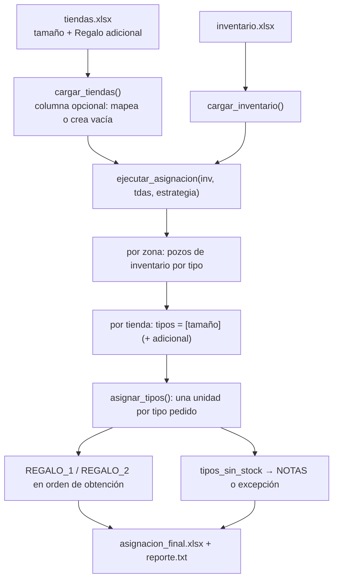

# Regalo adicional por tienda

**Fecha:** 2026-09-09
**Estado:** aprobado, pendiente de plan de implementación

---

## Problema

Hoy la cantidad de regalos es un parámetro global de la interfaz: un selectbox
"N° de regalos por tienda" con las opciones 1 y 2, que se aplica por igual a
las 1840 tiendas. No hay forma de decir "estas 200 tiendas reciben dos regalos
y el resto uno", ni de pedir que el segundo regalo salga de un segmento
distinto al de la tienda.

La plantilla de tiendas ya resuelve el problema desde el lado de los datos: la
hoja `tiendas` de `TIENDAS_PLANTILLA_FINAL (2).xlsx` trae una columna nueva
llamada **`Regalo adicional`**, al lado de `tamaño`, que contiene un tipo de
regalo (`pequeña`, `mediana`, `grande`, …) con el mismo vocabulario que
`tamaño`. Está vacía en las 1840 filas porque todavía no se usa.

## Objetivo

Que la cantidad de regalos de cada tienda salga de sus datos y no de un control
global:

- Celda `Regalo adicional` vacía → la tienda recibe **1 regalo**, del tipo que
  indica su columna `tamaño`.
- Celda con un tipo → la tienda recibe **2 regalos**: el primero del pozo de
  inventario de su `tamaño`, el segundo del pozo del tipo indicado en
  `Regalo adicional`. Los dos tipos pueden ser distintos.

El selectbox de 1 ó 2 regalos desaparece de la interfaz y el parámetro
`n_regalos` desaparece del motor.

## Decisiones tomadas

| Pregunta | Decisión |
| --- | --- |
| ¿El valor de `Regalo adicional` define el pozo del 2° regalo, o solo marca "dale 2"? | **Define su propio pozo.** Una tienda `pequeña` con adicional `mediana` recibe un artículo del stock PEQUEÑO y otro del stock MEDIANO, ambos de su zona. |
| ¿Qué pasa si solo se consigue uno de los dos? | **Se entrega el que sí hay, con nota.** Cuenta como tienda asignada y suma al conteo de parciales del reporte. |
| ¿Qué pasa si el archivo no trae la columna? | **Se procesa igual**, asumiendo la columna vacía (todas las tiendas con 1 regalo). La app avisa en pantalla que no la encontró. La columna es opcional, no obligatoria. |

## Fuera de alcance

El desajuste de vocabulario entre plantillas (`pequeña` en tiendas contra
`PEQUEÑO` en inventario) no se toca. El cruce sigue siendo exacto salvo
mayúsculas, espacios y acentos, y corregir los datos de origen queda del lado
del usuario, que trabajará con la plantilla ya normalizada.

---

## Arquitectura

La restricción de diseño es que el motor deje de razonar en "cuántos regalos"
y pase a razonar en "qué tipos pide esta tienda". Cada tienda aporta una lista
de tipos solicitados —`[tamaño]` o `[tamaño, adicional]`— y el motor sirve una
unidad por cada elemento de la lista. Con eso hay un solo camino de código en
vez de dos ramas (`n == 1` / `n == 2`), y un eventual tercer regalo sería un
elemento más en la lista, sin tocar la estructura.

Los cuatro módulos conservan sus responsabilidades actuales:
`carga_datos.py` mapea y valida sin saber de Streamlit, `asignador_regalos.py`
asigna sin saber de Excel de entrada, `app.py` solo presenta, e
`info_version.py` verifica el despliegue ejecutando el motor real.

### 1. Carga — `carga_datos.py`

Se agrega el concepto de **columna opcional**, que hoy no existe:

```python
TDAS_COLUMNAS_OPCIONALES = {
    "TipoRegaloAdicional": ("REGALO ADICIONAL", "TIPO REGALO ADICIONAL"),
}
```

`normalizar_encabezado` ya ignora mayúsculas, acentos, espacios y guiones
bajos, así que `Regalo adicional`, `REGALO_ADICIONAL` y `regaloadicional`
calzan con el primer alias sin necesidad de listarlos.

`preparar_dataframe` recibe un parámetro nuevo `opcionales` (por defecto
vacío) y lo trata así:

- **Presente:** se renombra al nombre interno, igual que una columna obligatoria.
- **Ausente:** *no* es un error. Se crea la columna con cadena vacía y el
  nombre interno se anota en `df.attrs["columnas_opcionales_ausentes"]`.

El motor entonces siempre encuentra `TipoRegaloAdicional`, y solo un módulo
—el de carga— decide qué hacer cuando falta. La contrapartida es que, con una
plantilla vieja, el Excel de salida gana una columna vacía llamada
`TipoRegaloAdicional`; es un costo aceptable y además deja a la vista que la
plantilla está desactualizada.

`cargar_tiendas` pasa `TDAS_COLUMNAS_OPCIONALES`. `cargar_inventario` no
cambia. `elegir_hoja` tiene en cuenta también los alias opcionales al puntuar
las hojas, de modo que la columna nueva ayude a identificar la hoja correcta
en vez de ser ignorada.

### 2. Motor — `asignador_regalos.py`

**Firma:** `ejecutar_asignacion(inv, tdas, estrategia)`. Se elimina
`n_regalos`. Es un cambio incompatible y obliga a actualizar `app.py`,
`info_version.py` y las pruebas.

**Clave de cruce nueva:** `COL_TIPO_ADIC_KEY = "_TipoAdicKey"`, generada con
la misma `clave_normalizada` que las demás (sin acentos, sin espacios,
mayúsculas) a partir de `TipoRegaloAdicional`. Se elimina junto a las otras
auxiliares antes de exportar.

**Tipos solicitados por tienda:**

```python
tipos = [tipo_key]
if tipo_adic_key:            # cadena vacía o solo espacios ⇒ un solo regalo
    tipos.append(tipo_adic_key)
```

**Función de asignación.** `intentar_asignar_para_tienda(inv_tipo, n_regalos)`
se reemplaza por:

```python
asignar_tipos(inv_por_tipo, tipos)
    → (codigos, descripciones, tipos_sin_stock, inv_por_tipo_actualizado)
```

Recorre los tipos pedidos en orden y toma una unidad del pozo de cada uno. Un
tipo que no existe en la zona, o cuyo pozo está agotado, se acumula en
`tipos_sin_stock` y no interrumpe el resto. No muta los DataFrames recibidos.

Cuando dos pedidos caen en el **mismo** pozo (tienda `pequeña` con adicional
`pequeña`) se conserva la preferencia de variedad que ya existe hoy, en el
mismo orden de intentos:

1. Dos artículos distintos, una unidad de cada uno.
2. Dos unidades del mismo artículo.
3. Dos filas de stock del mismo artículo, una unidad de cada una.

**Llenado de ranuras.** Los regalos conseguidos ocupan `REGALO_1` y `REGALO_2`
en el orden en que se obtuvieron, sin dejar huecos. Por lo tanto `REGALO_1`
nunca queda vacío si hubo algo que entregar, incluso cuando lo que faltó fue
el regalo principal. Esto mantiene válida la métrica "tiendas con asignación",
que se calcula como `REGALO_1 != ""`.

**Notas y excepciones:**

| Caso | `NOTAS` | ¿Excepción? |
| --- | --- | --- |
| Los 2 entregados | *(vacío)* | No |
| Falta el adicional | `Asignación parcial: sin stock del regalo adicional 'mediana' en la zona LIMA SUR` | No, cuenta como parcial |
| Falta el principal, hay adicional | `Asignación parcial: sin stock del tipo 'pequeña' en la zona LIMA SUR` | No, cuenta como parcial |
| No se consiguió nada | Motivo nombrando el o los tipos que faltaron y la zona | Sí |
| Zona sin ningún inventario | `No hay inventario disponible en la zona X` (igual que hoy) | Sí |

**Orden de servicio.** No cambia respecto de hoy: se recorre zona por zona y,
dentro de cada zona, tienda por tienda en el orden del archivo. Cada tienda
toma **los dos regalos que pide antes de pasar a la siguiente**; no hay reserva
previa ni optimización global. En consecuencia, si el stock de un tipo se
agota, las tiendas que quedan al final del archivo son las que reciben la
asignación parcial. Es el mismo criterio que rige hoy con `n_regalos = 2`.

**Reporte.** La línea `NumeroRegalosPorTienda: {n}` ya no tiene sentido y se
reemplaza por dos (los números son ilustrativos):

```
Tiendas que piden regalo adicional: 214
Regalos adicionales entregados: 198
```

El resto del reporte (estrategia, tiendas procesadas, tiendas con asignación,
parciales, total de regalos, unidades restantes, advertencias de fechas,
detalle de excepciones) se mantiene sin cambios.

**Contadores para la UI.** "Regalos adicionales entregados" **no** se puede
derivar de `REGALO_2 != ""`: cuando falta el principal, el regalo adicional
ocupa `REGALO_1` y ese conteo lo perdería. El motor, que sí sabe qué tipo
sirvió en cada caso, publica los contadores en
`df_tiendas_final.attrs["metricas"]`:

```python
{"piden_adicional": int, "adicionales_entregados": int, "parciales": int}
```

La UI y el reporte leen de ahí. Es el mismo mecanismo que ya se usa para
`attrs["hoja"]`.

### 3. Interfaz — `app.py`

- Se elimina el selectbox `n_regalos`. La columna de parámetros queda solo con
  la estrategia, más una nota: la cantidad de regalos la define la columna
  `Regalo adicional` de la plantilla de tiendas.
- `procesar(inv_file, tdas_file, estrategia)` y la rama de datos de ejemplo se
  ajustan a la firma nueva.
- Si `df.attrs["columnas_opcionales_ausentes"]` trae `TipoRegaloAdicional`, se
  muestra un `st.info` avisando que no se encontró la columna y que por eso
  cada tienda recibe un solo regalo.
- Se agrega una cuarta métrica, "Regalos adicionales entregados", leída de
  `asignaciones.attrs["metricas"]`, junto a las tres actuales.

### 4. Autodiagnóstico — `info_version.py`

- Los helpers `_tiendas()` y `datos_de_ejemplo()` incorporan la columna
  `TipoRegaloAdicional`. Los datos de ejemplo incluyen al menos una tienda con
  regalo adicional de un tipo distinto al suyo, para que el botón "Datos de
  ejemplo" ejercite el caso nuevo.
- El chequeo `_chequeo_regalos_distintos` ("Dos regalos distintos") pasa a ser
  **"Regalo adicional de otro tipo"**: una tienda `T1` con adicional `T2` debe
  recibir un artículo de cada pozo, y el chequeo verifica que los dos códigos
  correspondan a artículos de tipos distintos.
- Se agrega el chequeo **"Columna opcional ausente"**: un DataFrame de tiendas
  sin `TipoRegaloAdicional` debe procesarse sin error, con todas las tiendas en
  un regalo.
- `VERSION` sube a `3.0.0`: cambia el contrato del archivo de entrada y la
  firma pública del motor.

### 5. Pruebas — `tests/`

Se actualizan todas las llamadas existentes a `ejecutar_asignacion` para la
firma sin `n_regalos`, y se agregan casos para:

- Regalo adicional de un tipo **distinto**: un artículo de cada pozo.
- Regalo adicional del **mismo** tipo: dos artículos distintos (variedad).
- Parcial por falta del **adicional**: `REGALO_1` lleno, `REGALO_2` vacío, nota.
- Parcial por falta del **principal**: `REGALO_1` lleno con el adicional, nota.
- Celda **vacía** y celda con **solo espacios**: un solo regalo, sin nota.
- Tipo adicional **inexistente** en la zona: parcial con nota, no excepción.
- **Columna ausente** en el Excel de tiendas: carga sin error, columna creada
  vacía y el faltante anotado en `attrs`.
- Conservación de stock: unidades iniciales = entregadas + restantes, con
  regalos adicionales en juego.

### 6. Documentación — `README.md`

- Tabla de `tiendas.xlsx`: se agrega la fila `TipoRegaloAdicional` /
  `REGALO ADICIONAL`, marcada como opcional.
- La sección "Regalos por tienda" se reescribe: la cantidad ya no se elige en
  la interfaz, sale de la columna. Su diagrama se reemplaza por uno que
  refleje los dos pozos independientes y los tres desenlaces (dos regalos,
  parcial, sin asignación).
- Se corrige la sección "Cómo asigna" para mencionar el segundo pozo.
- Se quita la mención al selector de 1 ó 2 regalos.

---

## Flujo de datos



## Manejo de errores

| Situación | Comportamiento |
| --- | --- |
| Columna `Regalo adicional` ausente | Se crea vacía, aviso en la UI, proceso continúa |
| Celda vacía o con espacios | Un solo regalo, sin nota |
| Tipo adicional que no existe en el inventario de la zona | Parcial con nota; la tienda cuenta como asignada |
| Tipo adicional agotado durante la corrida | Idéntico al caso anterior |
| Ninguno de los dos tipos disponible | Excepción, `REGALO_1` y `REGALO_2` vacíos, motivo en `NOTAS` y en el reporte |
| Columnas obligatorias faltantes | Sin cambios: la carga falla con el detalle de lo que falta |
